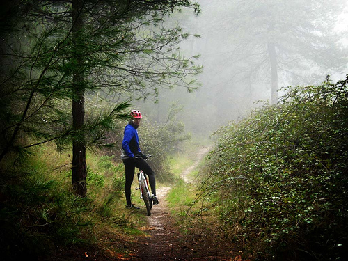
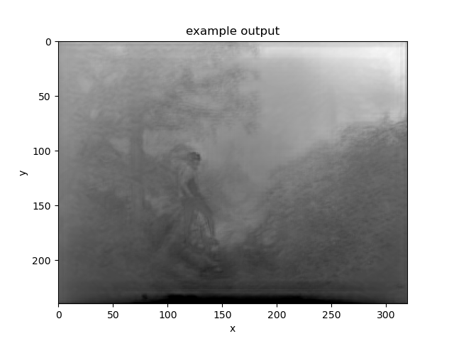

# e4040-2022Fall-project-DLDP
  - Welcome to the repository for e4040-2022Fall-project-DLDP. Group DLDP is with members xb2165 (Xin Bu), yl5086 (Yufan Luo) and zy2523 (Zhihao Yi).
  - The topic of this group project is Single-Image Depth Perception in the Wild inspired by and based on the work of Weifeng Chen, Zhao Fu, Dawei Yang, and Jia Deng (http://www-personal.umich.edu/~wfchen/depth-in-the-wild/).

# Oue design
  - The problem is to predict pixel-wise depth for designated RGB input image. To solve this problem, a deep network is trained to take a batch of RGB image as input, and the output is depth maps of size 240x320x1. For training and testing, the images are loaded from a series of .thumb files, and the labels are readed and loaded from a .csv file.
  - The code for loading images and labels can be found in utils.read_depth_info.py and loader.py.
  - The code for model construction can be found in utils.model.py.
  - The code for loss can be found in utils.loss.py.
  - The code for metrics can be found in utils.check.py.
  - Training and testing is done in Jupyter notebooks.
  
# Our model
  - Our model is a hourglass network with skip connections and is built with Inception modules.
  - The model is saved with TensorFlow 2.4.0.
.png)

# Our result
  - Sample input


  - Sample output



# Organization of this directory
```
./
├── E4040.2022Fall.DLDP.report.xb2165.yl5086.zy2523.pdf
├── README.md
├── Main.ipynb
├── data
│   ├── DIW_test
│   ├── DIW_test.csv
│   ├── DIW_train_val
│   └── DIW_train_val.csv
├── figures
│   ├── DLDP_xb2165_yl5086_zy2523_gcp_work_example_screenshot_1.png
│   ├── DLDP_xb2165_yl5086_zy2523_gcp_work_example_screenshot_2.png
│   └── DLDP_xb2165_yl5086_zy2523_gcp_work_example_screenshot_3.png
├── model_Hourglass
│   ├── variables
│   |      ├── variables.data-00000-of-00001
│   |      └── variables.index
│   ├── keras_metadata.pb
│   └── saved_model.pb
├── model_Hourglass(art).png
├── model_Hourglass.png
├── sample_input.png
├── sample_output.png
└── utils
    ├── check.py
    ├── loader.py
    ├── loss.py
    ├── model.py
    └── read_depth_info.py

6 directories, 21 files
```
